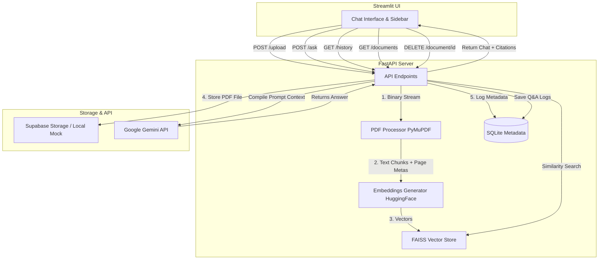

# Production-Ready AI PDF Question Answering Chatbot (Supabase Storage Edition)

This project is a high-performance, production-quality AI PDF Question Answering Chatbot built with Python, FastAPI, Streamlit, LangChain, and Google Gemini API. It implements Retrieval-Augmented Generation (RAG) using HuggingFace sentence embeddings and a FAISS vector database.

This version is configured to store PDF documents securely inside **Supabase Storage**.

---

## 🏛️ Project Architecture



---

## 📂 Folder Structure

```
pdf-qa-chatbot/
│
├── backend/
│   ├── __init__.py
│   ├── main.py                 # FastAPI bootstrap entrypoint
│   ├── config/
│   │   ├── __init__.py
│   │   └── settings.py         # Configuration loader & Pydantic validation
│   ├── database/
│   │   ├── __init__.py
│   │   ├── connection.py       # SQLite connection context manager
│   │   └── models.py           # SQLite schemas & CRUD operations
│   ├── models/
│   │   ├── __init__.py
│   │   └── schemas.py          # API Pydantic schemas (Request/Response)
│   ├── routers/
│   │   ├── __init__.py
│   │   ├── ask.py              # POST /ask (RAG & Gemini pipeline)
│   │   ├── history.py          # GET/DELETE /history (conversation logs)
│   │   └── upload.py           # POST /upload, GET /documents, DELETE /document/{id}
│   ├── services/
│   │   ├── __init__.py
│   │   └── storage_service.py  # Supabase Storage uploader (with Local Disk mock fallback)
│   └── rag/
│       ├── __init__.py
│       ├── pdf_processor.py    # PyMuPDF parser and text character-splitter
│       ├── embeddings.py       # HuggingFace sentence transformer loading
│       └── vector_store.py     # Local FAISS index load/save and deletion helper
│
├── frontend/
│   └── app.py                  # Streamlit application UI
│
├── .env                        # Local configuration secrets (gitignored)
├── .env.example                # Example configuration template
├── requirements.txt            # Python dependencies
├── init_db.py                  # Database initialization script
└── verify_rag.py               # System diagnostics script
```

---

## ⚙️ Setup Instructions

### 1. Prerequisites
- Python 3.10+ installed
- Git installed (optional)

### 2. Installation
Clone or navigate to the project directory:
```bash
cd pdf-qa-chatbot
```

Create a virtual environment and activate it:
```bash
python -m venv venv
# On Windows (PowerShell):
.\venv\Scripts\Activate.ps1
# On macOS/Linux:
source venv/bin/activate
```

Install dependencies:
```bash
pip install -r requirements.txt
```

### 3. Environment Configuration
Create a `.env` file in the root directory and add your credentials:
```env
# Gemini API Credentials
GEMINI_API_KEY=your_gemini_api_key_here

# Supabase Storage Credentials (Set LOCAL_MOCK_STORAGE=True to test offline)
SUPABASE_URL=https://mrpiumtpvzknocpeyicy.supabase.co
SUPABASE_KEY=your_supabase_anon_or_service_role_key_here
SUPABASE_BUCKET_NAME=pdf-bot-bucket

# Toggle fallback local storage for mock uploads (True = runs offline on local files)
LOCAL_MOCK_STORAGE=True
```

### 4. Run System Verification
Run the diagnostic script to ensure embeddings model downloading, database creation, and settings load correctly:
```bash
python verify_rag.py
```

---

## 🛠️ Step-by-Step Run Instructions

Open two separate terminal windows with virtual environment activated:

### Step A: Start the FastAPI Backend
```bash
uvicorn backend.main:app --port 8000 --reload
```
The interactive Swagger API documentation will be available at [http://127.0.0.1:8000/docs](http://127.0.0.1:8000/docs).

### Step B: Start the Streamlit Frontend
```bash
streamlit run frontend/app.py
```
The Streamlit app will load automatically in your default browser at [http://localhost:8501](http://localhost:8501).

---

## 🔑 Supabase Storage Configuration Guide

If you wish to switch from local disk mock storage to live Supabase Storage:

1. **Log in to Supabase Dashboard** (https://supabase.com).
2. Go to **Storage** in the left menu.
3. Click **New Bucket**.
   - Set the bucket name (e.g., `pdf-bot-bucket`).
   - Choose whether the bucket is **Public** or **Private**.
     - If public, files are accessible via the generated public URL.
     - If private, set up appropriate storage security policies.
4. Go to **Project Settings** -> **API**.
   - Copy your **Project URL** (under API Settings). This matches `SUPABASE_URL`.
   - Copy your **Service Role Key** (under `service_role` secret key). This matches `SUPABASE_KEY` (using service_role key allows the backend API to bypass RLS policies and manage files seamlessly).
5. Update your `.env` file with these values and set `LOCAL_MOCK_STORAGE=False`.

---

## 📡 REST API Documentation

### 📤 `POST /upload`
Uploads a new PDF document.
- **Request**: Multipart Form Data with file.
- **Response**:
  ```json
  {
    "id": 1,
    "filename": "annual_report.pdf",
    "s3_url": "https://mrpiumtpvzknocpeyicy.supabase.co/storage/v1/object/public/pdf-bot-bucket/annual_report.pdf",
    "upload_time": "2026-08-01T12:00:00"
  }
  ```

### 💬 `POST /ask`
Queries the database using retrieved contexts.
- **Request**:
  ```json
  {
    "question": "What is the revenue increase for Q3?"
  }
  ```
- **Response**:
  ```json
  {
    "answer": "The revenue increased by 14% in Q3, reaching $4.2M.",
    "sources": [
      {
        "filename": "annual_report.pdf",
        "page": 7
      }
    ]
  }
  ```

### 📚 `GET /documents`
Lists all uploaded documents.
- **Response**: Array of `DocumentResponse` items.

### 🗑️ `DELETE /document/{id}`
Deletes a document by ID (removes it from database, storage, and FAISS index).

### 💬 `GET /history`
Retrieves past conversations.

### 🧹 `DELETE /history`
Wipes all entries from chat history.
